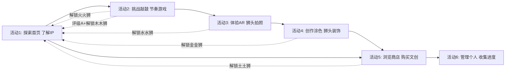
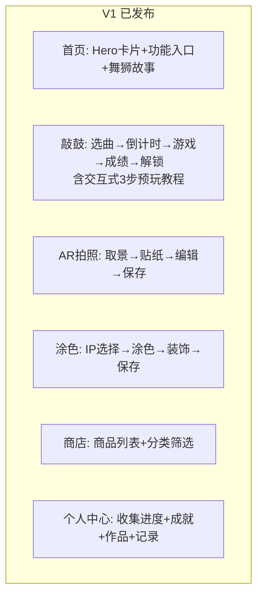
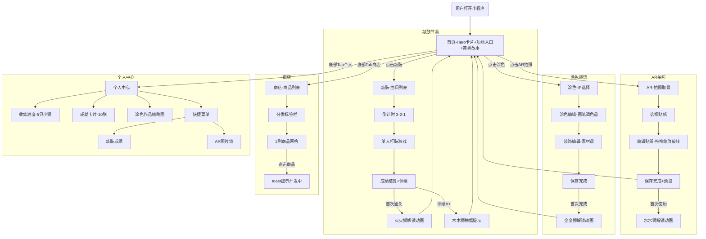
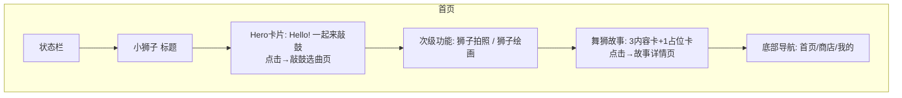
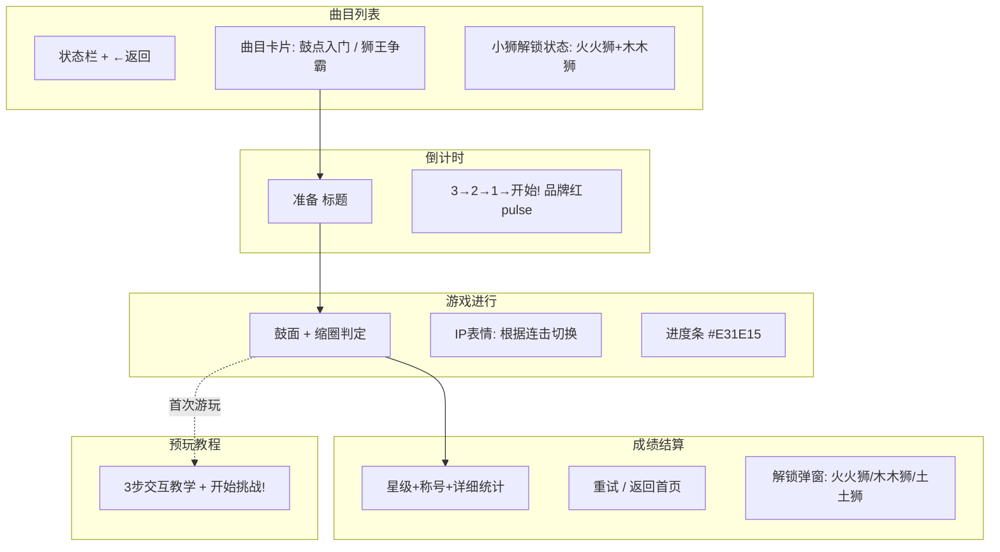
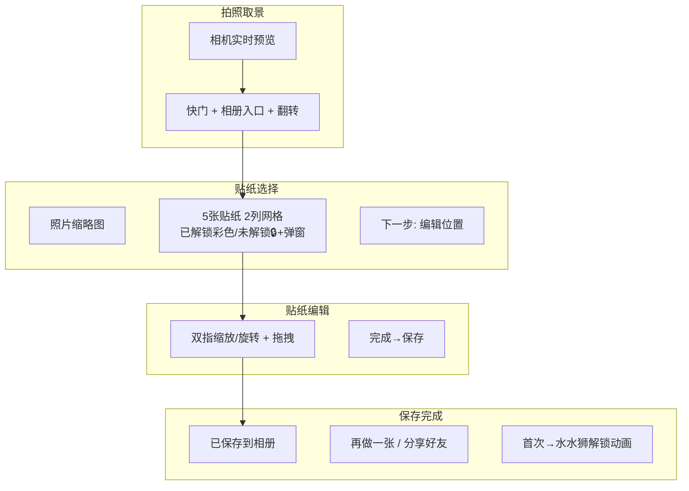
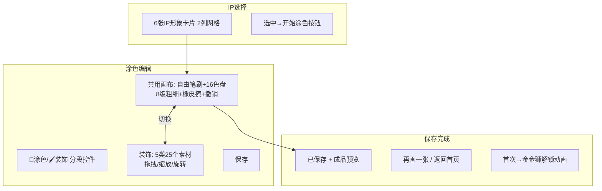
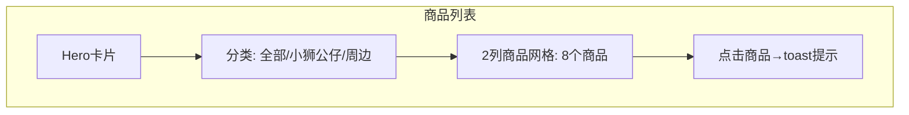
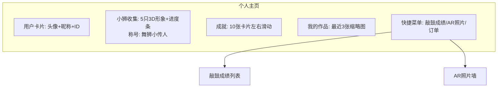

# 广东舞狮文创小程序 · 用户故事地图

> 基于：交互设计文档 V3.1 | 方法：Jeff Patton User Story Mapping | 日期：2026-06-20

---

## 一、用户

### 用户画像

| 角色 | 年龄 | 特点 | 目标 |
|------|------|------|------|
| 🧒 小明（儿童） | 4-12 岁 | 喜欢鲜艳色彩、音效反馈、即时奖励；精细动作发育中 | 通过"玩"体验舞狮乐趣，收集小狮 |
| 👩 小明的妈妈（家长） | 28-40 岁 | 购买决策者，关注教育价值和安全 | 陪伴孩子，发现文创商品并购买 |

---

## 二、用户叙事

> 小明打开小程序，敲鼓游戏让他感受到醒狮鼓点的节奏魅力，AR 拍照让他戴上狮头贴纸变身小狮子，涂色创作让他自由表达对舞狮的想象。过程中他不断解锁可爱的五行小狮，最后和妈妈一起在商店发现喜欢的文创商品。

---

## 三、骨架：核心活动地图

---

## 四、步骤 → 任务 详细展开

> **优先级标记：** p0（MVP 必须）| p1（重要）| p2（锦上添花）

---

### 活动 1：探索首页 & 了解小狮 IP

**对应页面：** `pages/index/` 首页

| 步骤 | 任务 | 页面/状态 | 优先级 |
|------|------|----------|--------|
| **1.1 进入首页** | 加载骨架屏（小狮行 + 卡片轮廓） | 首页-骨架屏 | p0 |
| | 展示 Hero 招呼卡片（Hello! 一起来敲鼓） | 首页-默认态 | p0 |
| | 展示功能入口卡片（敲鼓/AR/涂色） | 首页-卡片区 | p0 |
| | 底部导航栏（首页/商店/我的） | 全局底部导航 | p0 |
| **1.2 进入功能** | 点击敲鼓卡片 → 直接进入选曲页（V2.5已移除模式弹窗） | 敲鼓曲目选择页 | p0 |
| | 点击 AR 拍照卡片 → 直接进入取景页 | AR 拍照取景 | p0 |
| | 点击涂色装饰卡片 → IP 选择 | IP 选择页 | p0 |
| | 切换底部标签栏到商店/个人中心 | 商店/个人中心 | p0 |

---

### 活动 2：挑战敲鼓节奏游戏

**对应页面：** `pages/drum/drum` 页面（曲目列表/倒计时/单人游戏/成绩）

#### 步骤 2.1：选择曲目（V2.5 已移除模式弹窗，直接进入选曲）

| 任务 | 页面/状态 | 优先级 |
|------|----------|--------|
| 显示 2 首曲目卡片（鼓点入门/狮王争霸） | 曲目列表页 | p0 |
| 底部小狮解锁状态（火火狮+木木狮） | 曲目列表页 | p0 |

#### 步骤 2.2：选择曲目

| 任务 | 页面/状态 | 优先级 |
|------|----------|--------|
| 加载曲目列表（已/未挑战状态 + 评级） | 曲目列表页 | p0 |
| 显示火火狮/木木狮解锁状态 | 曲目列表-解锁提示 | p0 |
| 点击曲目卡片 → 倒计时页 | 曲目列表-点击态 | p0 |
| ← 返回按钮 → 回到首页 | 曲目列表-返回 | p0 |

#### 步骤 2.3：倒计时准备

| 任务 | 页面/状态 | 优先级 |
|------|----------|--------|
| 显示居中"准备"标题 | 倒计时页-标题 | p0 |
| 数字 3→2→1→开始！品牌红 pulse 动画 | 倒计时页-数字动画 | p0 |
| 0.6s 间隔，完成后立即进入游戏 | 倒计时页-过渡 | p0 |
| 无可退出按钮，自动完成 | 倒计时页-约束 | p0 |

#### 步骤 2.4：单人打鼓

| 任务 | 页面/状态 | 优先级 |
|------|----------|--------|
| 鼓面渲染 + 光点提示系统（边缘环形带） | 单人游戏页-主界面 | p0 |
| 4 种鼓点判定：center/left/right/double | 单人游戏页-判定 | p0 |
| 判定反馈：火焰粒子/good 光晕/miss 灰色X | 单人游戏页-反馈 | p0 |
| 进度条（品牌红 #E31E15 纯色） | 单人游戏页-进度条 | p0 |
| 连击 5 perfect → combo 加分 + 文字 | 单人游戏页-连击 | p0 |
| ← 暂停 → 确认弹窗 [继续] [退出] | 单人游戏页-暂停 | p0 |
| 首次进入交互式 3 步预玩教程（文字引导 + "开始挑战！"） | 引导遮罩 | p0 |

#### 步骤 2.6：查看成绩 & 解锁

| 任务 | 页面/状态 | 优先级 |
|------|----------|--------|
| 星级展示（逐颗弹出，200ms/颗） | 游戏结果页-星级 | p0 |
| 称号大字 + 弹跳动画 | 游戏结果页-称号 | p0 |
| 详细统计（可折叠）：perfect/good/miss/combo/总分 | 游戏结果页-详情 | p0 |
| [重试] → 倒计时页 / [返回🏠] → 首页 | 游戏结果页-按钮 | p0 |
| 首次通关 → 火火狮全屏解锁动画（3s 自动消失） | 解锁动画弹窗 | p0 |
| 评级 A+ → 木木狮横幅提示（2s） | 解锁通知 | p0 |

---

### 活动 3：体验 AR 狮头拍照

**对应页面：** `pages/ar/` 系列页面（取景/贴纸选择/贴纸编辑/保存完成）

#### 步骤 3.1：拍照取景

| 任务 | 页面/状态 | 优先级 |
|------|----------|--------|
| 全屏实时相机预览 | 拍照取景页-取景 | p0 |
| 📸 快门按钮（≥72pt 直径，缩放+闪光动画） | 拍照取景页-快门 | p0 |
| 相册入口（左下角缩略图） | 拍照取景页-相册 | p0 |
| 翻转摄像头按钮 | 拍照取景页-翻转 | p0 |
| ← 返回（首次确认弹窗，再次直接退出） | 拍照取景页-退出 | p0 |
| 拍照 loading（1s 内完成）→ 自动进入贴纸选择 | 拍照取景页-拍摄中 | p0 |

#### 步骤 3.3：选择贴纸

| 任务 | 页面/状态 | 优先级 |
|------|----------|--------|
| 照片缩略图（顶部居中） | 贴纸选择页-预览 | p0 |
| 贴纸网格 2 列（≥80pt×80pt，已解锁彩色/未解锁🔒） | 贴纸选择页-网格 | p0 |
| 贴纸选中态：品牌红边框 + 浅粉底 | 贴纸选择页-选中 | p0 |
| 点击未解锁贴纸 → 底部提示卡片 | 贴纸选择页-锁定提示 | p0 |
| [下一步：编辑位置] → 编辑页 | 贴纸选择页-按钮 | p0 |

#### 步骤 3.4：编辑贴纸

| 任务 | 页面/状态 | 优先级 |
|------|----------|--------|
| 单指拖拽移动贴纸 | 贴纸编辑页-拖拽 | p0 |
| 双指缩放 | 贴纸编辑页-缩放 | p0 |
| 双指旋转（自由角度） | 贴纸编辑页-旋转 | p0 |
| 边界限制（不可完全拖出画面） | 贴纸编辑页-边界 | p0 |
| 完成 ✓ → 保存 → 保存完成页 | 贴纸编辑页-保存 | p0 |

#### 步骤 3.5：保存分享

| 任务 | 页面/状态 | 优先级 |
|------|----------|--------|
| ✅ 已保存提示 + 成品预览 | 保存完成页-展示 | p0 |
| [再做一张] → 回到取景页 | 保存完成页-再来 | p0 |
| [分享好友] → 微信分享组件 | 保存完成页-分享 | p0 |
| 首次使用 AR → 水水狮全屏解锁动画 | 保存完成页-解锁 | p0 |
| 云作品集静默保存 + 相册写入 | 保存完成页-存储 | p0 |

---

### 活动 4：创作狮头涂色装饰

**对应页面：** `pages/color/color` 页面（IP 选择/涂色编辑/装饰编辑/保存完成）

#### 步骤 4.1：选择 IP

| 任务 | 页面/状态 | 优先级 |
|------|----------|--------|
| 6 张 IP 形象卡片（火火狮/火火狮·威/水水狮/金金狮/木木狮/土土狮） | IP 选择页 | p0 |
| 已解锁彩色+名称（火火狮默认解锁），未解锁灰色🔒 | IP 选择页-状态 | p0 |
| 选中态品牌红边框 #E31E15 + 开始涂色按钮出现 | IP 选择页-选中 | p0 |
| ← 返回首页 | IP 选择页-返回 | p0 |

#### 步骤 4.2：涂色编辑

| 任务 | 页面/状态 | 优先级 |
|------|----------|--------|
| 自由绘制笔刷（stroke-based drawing），16 色调色盘 | 涂色编辑页-绘制 | p0 |
| 画笔粗细 slider 8 级（2/3/4/6/8/10/14/20px） | 涂色编辑页-画笔 | p0 |
| 顶部标签切换 🎨涂色 / 🖌️装饰 | 涂色编辑页-模式切换 | p0 |
| 撤销（可连续，到初始状态按钮置灰） | 涂色编辑页-撤销 | p0 |
| 🧹橡皮擦（与颜色/装饰互斥） | 涂色编辑页-橡皮擦 | p0 |
| 保存 → 保存完成页 | 涂色编辑页-保存 | p0 |

#### 步骤 4.3：装饰编辑

| 任务 | 页面/状态 | 优先级 |
|------|----------|--------|
| 素材盘 5 种装饰（☁️云纹/🔥火焰/⭐星光/🌸花/🎀蝴蝶结） | 装饰编辑页-素材盘 | p0 |
| 点击缩略图 → 画布中央新增 | 装饰编辑页-放置 | p0 |
| 单击选中（红色虚线框）→ 拖拽移动 / 双指缩放(0.3x~3x) / 旋转 | 装饰编辑页-调整 | p0 |
| 画布空白处点击取消选中 | 装饰编辑页-取消选中 | p0 |
| 撤销操作 | 装饰编辑页-撤销 | p0 |

#### 步骤 4.4：保存 & 解锁

| 任务 | 页面/状态 | 优先级 |
|------|----------|--------|
| 保存完成页（半屏卡片底部上滑） | 保存完成页 | p0 |
| 首次完成 → 金金狮全屏解锁动画 | 保存完成页-解锁 | p0 |
| [再来一张] / [返回🏠] | 保存完成页-按钮 | p0 |
| 返回时如有未保存修改 → 确认弹窗 | 涂色编辑页-退出确认 | p0 |

---

### 活动 5：浏览商店 & 购买文创

**对应页面：** `pages/shop/` 系列页面（商品列表/搜索/商品详情）

#### 步骤 5.1：浏览商品

| 任务 | 页面/状态 | 优先级 |
|------|----------|--------|
| 加载骨架屏（2 列商品卡片轮廓） | 商品列表-骨架屏 | p0 |
| 分类标签栏（横向滚动，选中下划线） | 商品列表-分类 | p0 |
| 2 列商品网格（每列 50%） | 商品列表-商品 | p0 |
| 无限滚动加载更多 | 商品列表-加载更多 | p0 |
| 下拉刷新 | 商品列表-刷新 | p0 |
| 空列表 → 推荐商品 | 商品列表-空状态 | p1 |

---

### 活动 6：管理个人中心 & 收集进度

**对应页面：** `pages/profile/` 系列页面（个人中心/敲鼓成绩/AR照片/作品预览/小狮详情）

#### 步骤 6.1：查看个人主页

| 任务 | 页面/状态 | 优先级 |
|------|----------|--------|
| 英雄区 用户卡片（红→橙渐变 + 圆点 SVG + 头像 + 昵称 + ID） | 个人中心-用户卡片 | p0 |
| 5 只小狮收集进度（3D IP 形象, 未解锁 opacity 0.55 + lock-3d.png 叠加） | 个人中心-收集进度 | p0 |
| 进度条 + "X/5" 计数 | 个人中心-进度 | p0 |
| 称号显示（收集 ≥3 只时显示"🏅 舞狮小传人"） | 个人中心-称号 | p0 |
| 成就卡片（10张：8鼓点+1AR+1涂色，左右滑动） | 个人中心-成就 | p0 |
| 最近 3 张涂色作品缩略图 | 个人中心-作品 | p0 |
| 空状态："还没有作品，去创作吧~" | 个人中心-空状态 | p0 |
| 快捷菜单：敲鼓成绩/AR 照片/我的订单（3D 图标） | 个人中心-菜单 | p0 |

#### 步骤 6.2：查看敲鼓成绩

| 任务 | 页面/状态 | 优先级 |
|------|----------|--------|
| 曲目列表（最佳评级 + 最高分 + 尝试次数） | 敲鼓成绩页-列表 | p0 |
| 最近 5 次成绩记录 | 敲鼓成绩页-记录 | p0 |
| 空记录："还没有敲鼓记录" | 敲鼓成绩页-空状态 | p0 |

#### 步骤 6.3：查看 AR 照片

| 任务 | 页面/状态 | 优先级 |
|------|----------|--------|
| 照片墙网格展示 | AR 照片列表-网格 | p0 |
| 点击放大预览 | AR 照片列表-预览 | p0 |
| 空记录："还没有 AR 照片" | AR 照片列表-空状态 | p0 |

#### 步骤 6.4：查看涂色作品

| 任务 | 页面/状态 | 优先级 |
|------|----------|--------|
| 作品网格展示 | 作品集-网格 | p0 |
| 点击放大预览 | 作品集-预览 | p0 |
| 空状态引导 | 作品集-空状态 | p0 |

#### 步骤 6.5：管理订单

| 任务 | 页面/状态 | 优先级 |
|------|----------|--------|
| 跳转小程序联盟订单页 | 个人中心-订单入口 | p0 |

---

## 五、发布范围（V1）

---

## 六、页面实现清单（汇总）

| # | 页面 | 路径 | 状态 | 所属活动 | 优先级 |
|---|------|------|------|---------|--------|
| 1 | 首页（默认/骨架/错误） | `pages/index/index` | ✅ | 活动1 | p0 |
| 2 | 敲鼓游戏（曲目列表/倒计时/游戏/结算） | `pages/drum/drum`（state 切换） | ✅ | 活动2 | p0 |
| 3 | AR 拍照取景 | `pages/ar/ar`（state 切换） | ✅ | 活动3 | p0 |
| 4 | 涂色装饰 - IP 选择/涂色/装饰/保存 | `pages/color/color`（state 切换） | ✅ | 活动4 | p0 |
| 5 | 商店列表 | `pages/shop/shop` | ✅ | 活动5 | p0 |
| 6 | 个人中心 | `pages/mine/mine` | ✅ | 活动6 | p0 |
| 15 | 个人中心 | `pages/mine/mine` | ✅ | 活动6 | p0 |
| 16 | 个人中心子页面（详情/记录/照片） | 未独立建页，mine 内部处理 | ⬜ | 活动6 | p1 |

---

## 七、开发顺序（对齐技术规划文档 §8）

| 步骤 | 内容 | 涉及页面 | 预计 |
|------|------|---------|------|
| 4.1 | 项目骨架 + app 配置 | 全局 | 1d |
| 4.2 | 通用组件（导航/弹窗/提示/骨架屏） | 全局组件 | 1.5d |
| 4.3 | 云开发环境 + 数据库初始化 | 云函数 | 1d |
| 4.4 | 首页模块 | #1, #2 | 1d |
| 4.5 | 敲鼓游戏模块 | #3-#10 | 2d |
| 4.6 | 涂色装饰模块 | #15-#19 | 2d |
| 4.7 | 个人中心模块 | #22-#25 | 1d |
| 4.8 | AR 拍照模块 | #11-#14 | 1d |
| 4.9 | 商店模块 | #20-#21 + #26 | 1d |

> **总计：** 约 11.5 天（含缓冲）

---

## 八、用户旅程全局流程图

---

## 九、页面结构图

### 首页

### 敲鼓游戏

### AR 拍照

### 涂色装饰

### 商店

### 个人中心

